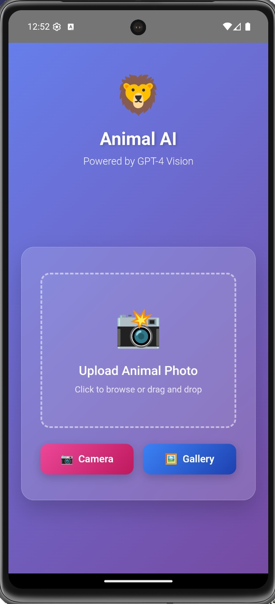
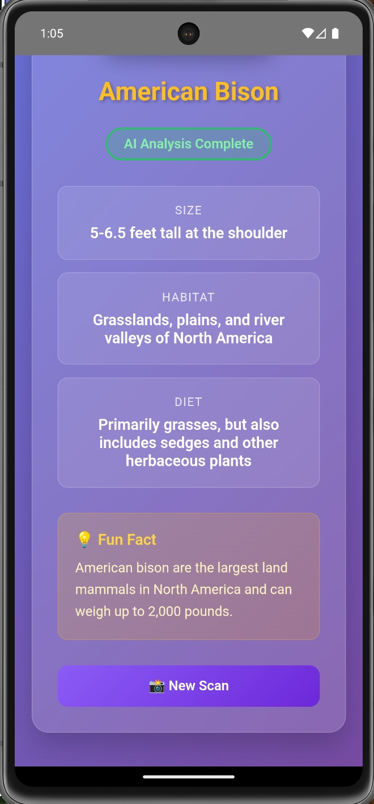
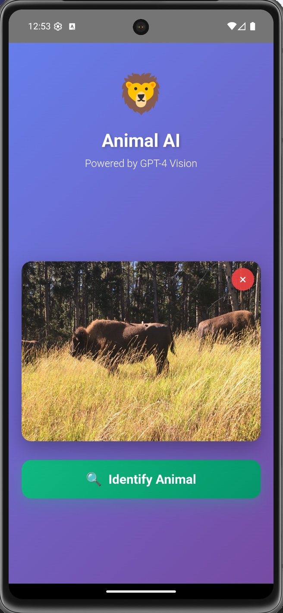
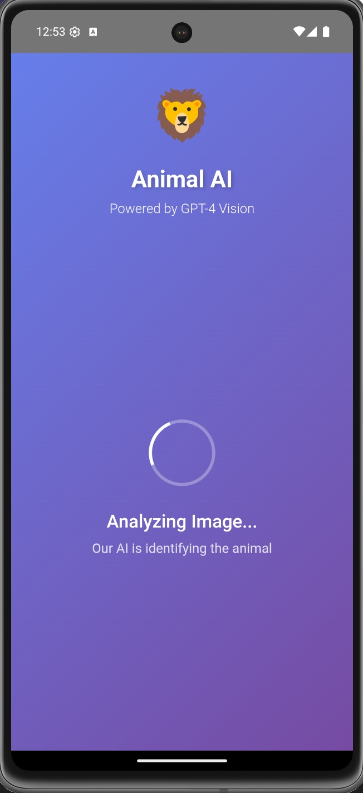
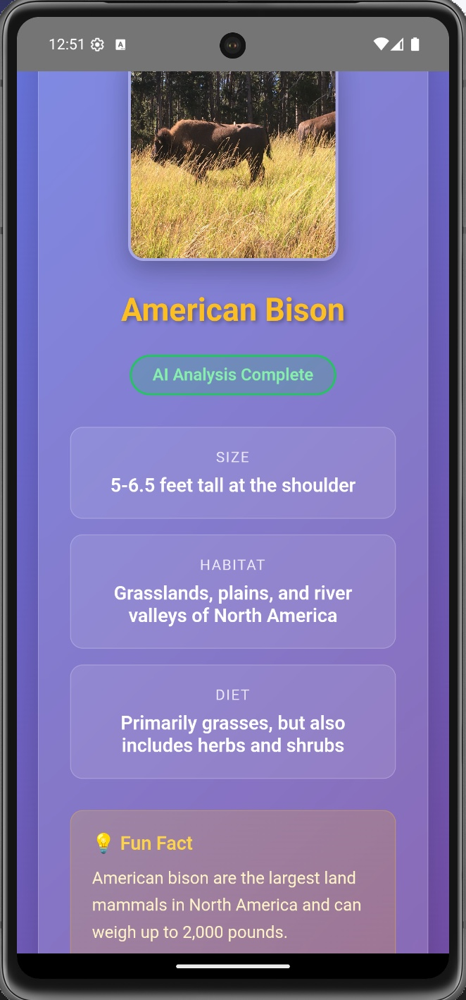

# Animal AI - Mobile Application

AI-powered animal identification app built with web technologies and deployed as a native Android application.

## 🚀 Features
- Real-time animal identification from camera or gallery photos
- Support for 100+ animal species with detailed information
- Offline-capable Progressive Web App architecture
- Native Android integration via Capacitor

## 🛠 Technology Stack
- **Frontend**: HTML5, CSS3, Vanilla JavaScript
- **Mobile Framework**: Capacitor 5.0
- **Platform**: Android (iOS ready)
- **Build System**: Gradle, Android Studio
- **Deployment**: Google Play Console

## 🎥 Demo Video
**[📹 Click here to view the one-minute demo](./one-minute-demo.mp4)**

## 📱 Live Status
Currently in closed alpha testing on Google Play Store with active user testing and feedback integration.

## 🏗 Architecture
The app uses a hybrid architecture combining web technologies with native mobile capabilities:
- Core logic in JavaScript for cross-platform compatibility
- Native camera and file system access through Capacitor plugins
- Responsive design that adapts to various screen sizes

## 📸 Screenshots

  
  
  
  
  

## 🔒 Security Note
This repository is a portfolio demonstration with sensitive configurations and API keys removed. For a live demo or technical discussion, please contact me directly.

---
*Developed by Liam Ben-Zvi*
